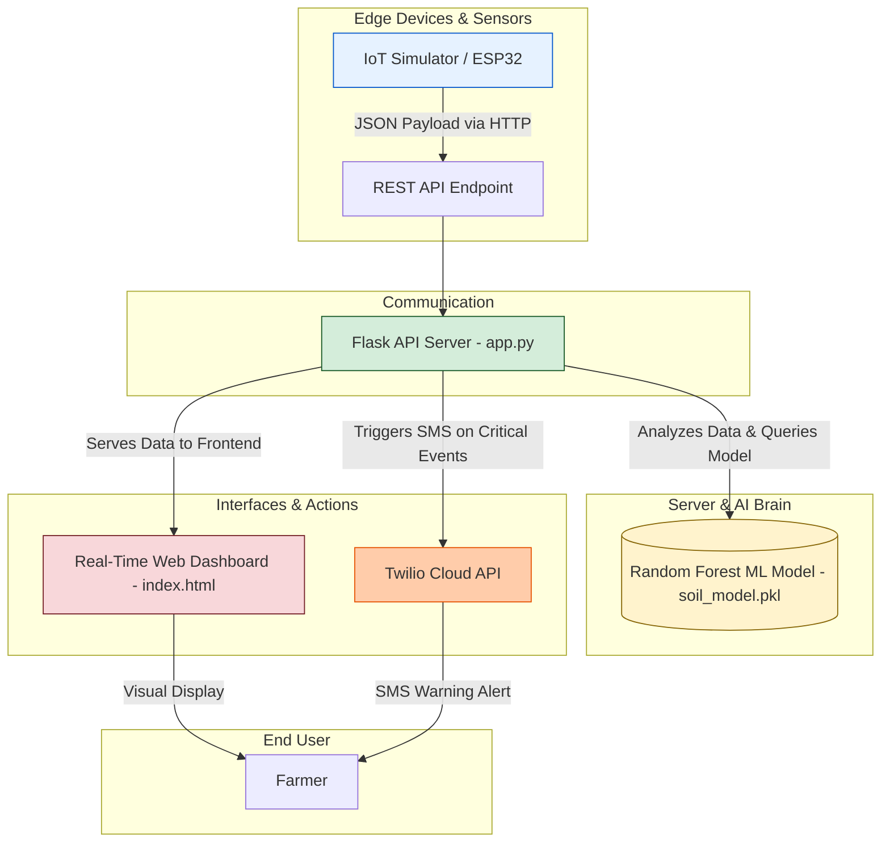

<div align="center">
  

  <h1>🌱 IoT-Enabled Precision Agriculture & AI Soil Monitoring</h1>
  <p>A full-stack IoT and Machine Learning solution for modern farming, providing real-time crop recommendations and critical soil health alerts via a secure web dashboard and SMS notifications.</p>
</div>

<div align="center">

[](https://github.com/SahilSinhaDev-cpu/-IoT-Enabled-Precision-Agriculture-System-with-AI-Driven-Soil-Health-Monitoring)
[](https://www.python.org/)
[](https://flask.palletsprojects.com/)
[](https://scikit-learn.org/)
[](https://developer.mozilla.org/en-US/docs/Web/JavaScript)
[](https://www.twilio.com)

</div>

---

## ✨ Key Features

| Feature | Description |
| :--- | :--- |
| **🧠 AI Crop Recommendation** | A **Random Forest Classifier**, trained on a 3,500-sample dataset, predicts the optimal crop (e.g., Rice, Maize, Coffee) based on live soil and environmental data. |
| **📡 Real-Time IoT Processing** | A decoupled architecture where edge sensors (simulated or physical) transmit JSON data to a central Flask REST API for processing. |
| **📊 Dynamic Web Dashboard** | A secure, login-protected dashboard built with Flask and vanilla JavaScript. It uses AJAX polling to display live data, charts, and AI insights without page reloads. |
| **🚨 Automated SMS Alerts** | Integrates with the **Twilio API** to send instant SMS notifications to the farmer's phone when critical thresholds (e.g., low nitrogen, high temperature) are breached. |
| **🔒 Secure User Authentication** | The dashboard is protected by a session-based login system, ensuring that only authorized users can view sensitive farm data. |
| **🌓 Light & Dark Mode** | A modern, user-friendly interface with a persistent light/dark mode toggle for comfortable viewing in any environment. |

## 🏗️ System Architecture
The project follows a classic 4-tier IoT architecture, ensuring modularity and scalability from the edge to the cloud.



---

## 🛠️ Technology Stack & Codebase

This project utilizes a modern stack for web development, machine learning, and cloud communication.

| Category | Technology | Purpose |
| :--- | :--- | :--- |
| **Backend** |   | Core application logic, REST API, and serving the web interface. |
| **Frontend** |    | Building the dynamic, responsive, and interactive user dashboard. |
| **Machine Learning** |   | Training the Random Forest model and handling the agricultural dataset. |
| **Cloud Services** |  | Sending programmatic SMS alerts for critical soil conditions. |
| **Data Visualization** |  | Rendering live, animated line charts for nutrient levels on the dashboard. |

### Codebase Structure

```
├── .gitignore             # Specifies files for Git to ignore (e.g., .env, *.pkl).
├── app.py                 # Main Flask application: handles routing, API endpoints, and business logic.
├── simulator.py           # Simulates an IoT device sending sensor data to the Flask server.
├── train_model.py         # Script to generate synthetic data and train the Random Forest model.
├── soil_model.pkl         # The pre-trained, serialized machine learning model file.
├── requirements.txt       # A list of all Python dependencies for the project.
├── .env                   # (You create this) Stores secret keys and API credentials.
└── templates/
    ├── base.html          # Base HTML template with Bootstrap and FontAwesome.
    ├── index.html         # The main dashboard page with all the data visualization components.
    └── login.html         # The secure login page for user authentication.
```

---

## 🚀 Getting Started

Follow these instructions to get a local copy of the project up and running.

### 1. Prerequisites
*   Python 3.8+
*   A Twilio account with an active phone number (for SMS alerts)

### 2. Installation & Setup

**A. Clone the repository:**
```bash
git clone https://github.com/SahilSinhaDev-cpu/-IoT-Enabled-Precision-Agriculture-System-with-AI-Driven-Soil-Health-Monitoring.git
cd -IoT-Enabled-Precision-Agriculture-System-with-AI-Driven-Soil-Health-Monitoring
```

**B. Create a virtual environment and install dependencies:**
```bash
# Create a virtual environment
python3 -m venv venv

# Activate it (macOS/Linux)
source venv/bin/activate
# On Windows, use: venv\Scripts\activate

# Install the required packages
pip install -r requirements.txt
```

**C. Set up environment variables:**
Create a file named `.env` in the root of the project directory. This file will securely store your API keys. Copy the contents of `.env.example` (if provided) or use the template below.

```ini
# .env
SECRET_KEY="a_very_strong_random_secret_key_for_flask_sessions"
TWILIO_ACCOUNT_SID="ACxxxxxxxxxxxxxxxxxxxxxxxxxxxxx"
TWILIO_AUTH_TOKEN="your_twilio_auth_token"
TWILIO_PHONE_NUMBER="+15017122661"
YOUR_PERSONAL_NUMBER="+15558675309" # The number to receive SMS alerts
```

### 3. Running the System

The system runs in two parts: the server and the simulator. You will need two separate terminal windows.

**Terminal 1: Start the Flask Web Server**
```bash
python app.py
```
The server will start on `http://127.0.0.1:5001`.

**Terminal 2: Start the IoT Simulator**
```bash
python simulator.py
```
The simulator will begin sending data to the server every 3 seconds.

### 4. Access the Dashboard
Open your web browser and navigate to **`http://127.0.0.1:5001`**.
Log in with the demo credentials:
*   **Username:** `farmer`
*   **Password:** `farm123`

You should now see the live dashboard, with data updating in real-time!

---

## 🔮 Future Enhancements

*   **Hardware Integration:** Replace `simulator.py` with a Python script running on an ESP32 or Raspberry Pi connected to physical NPK, DHT11, and pH sensors.
*   **Database Logging:** Integrate a database like SQLite or PostgreSQL to log historical sensor data for trend analysis and long-term performance tracking.
*   **Advanced Advisories:** Enhance the AI to provide more detailed advisories, such as specific fertilizer quantities or pest control recommendations.
